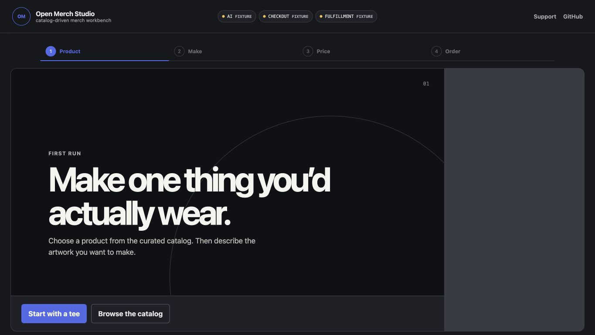
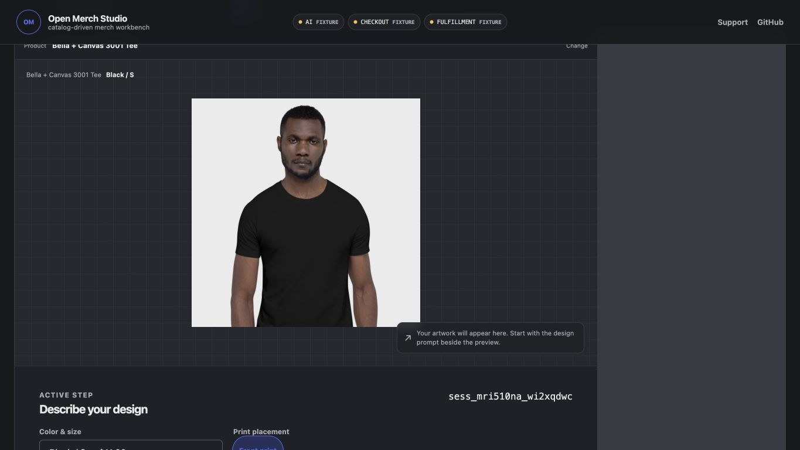
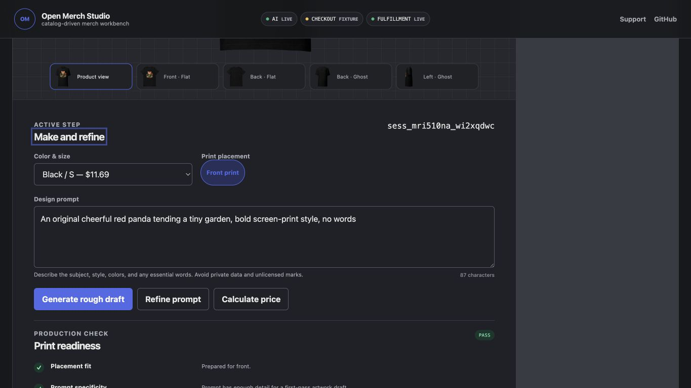
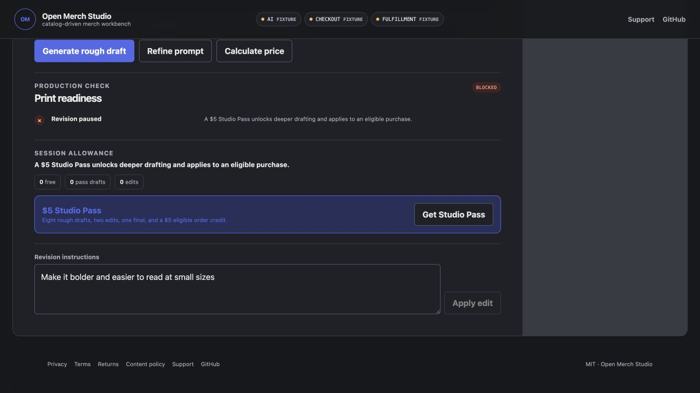
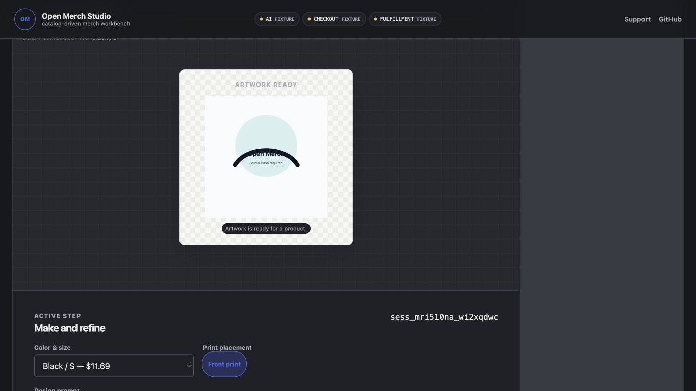
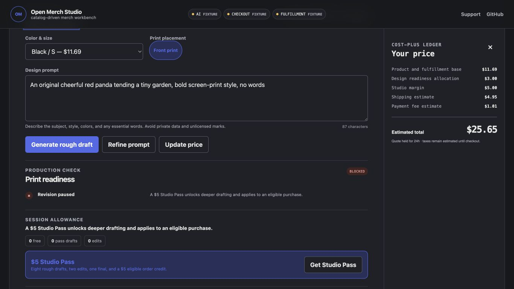
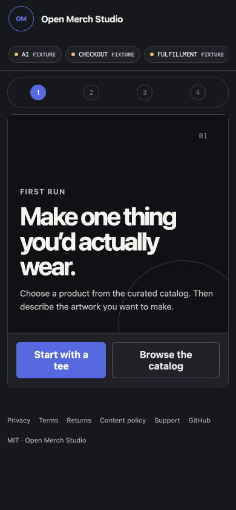
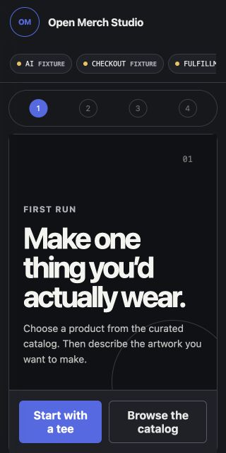
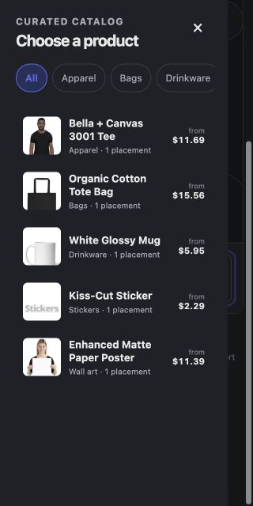

# Open Merch Studio Designer-Claims Audit

**Audit date:** 2026-07-12  
**Surface:** Production studio at `https://open-merch-studio-vercel-output.vercel.app`  
**Flow:** First visit → product selection → live generation/mockup → blocked revision → quote → refresh → narrow mobile  
**Target:** Trustworthy MVP checkout journey with keyboard- and mobile-usable guidance

## Overall Verdict

The designer's report is materially accurate. The revision defect is a confirmed P0: a free user can click an enabled edit action, receive a success-shaped blocked response, and have the last good artwork and mockups replaced by a Studio Pass placeholder. The layout, navigation, price anchoring, and responsive claims are also supported by current production evidence.

One allegation needs qualification: a blocked placeholder can receive a quote and expose the checkout form, but the backend still refuses to create a Stripe Checkout Session because no valid generated design asset is attached. That protects the charge, but the UI is still misleading and should be fixed.

Stripe mechanics can be manually tested with a valid draft once the Sandbox key is correctly installed. Do not invite external MVP users until the revision/session-safety ticket is complete.

## Captured Flow

### 1. First visit at 1365 × 768 — At risk

- The primary entry copy and two starting actions are clear.
- A 320px empty rail is visible at the right even though no price ledger exists.
- Provider badges say `FIXTURE` before any provider action, even though live AI and Printful are configured.

### 2. Tee selected — At risk

- The product preview dominates the viewport; the prompt and actions begin below the first screen.
- The empty-state hint says the prompt is beside the preview, but it is below it.
- The raw session ID is presented with the same visual prominence as task guidance.

### 3. Live draft and Printful mockup ready — Mixed

- Live generation, transparent print preparation, automatic mockup creation, and alternate mockup views worked.
- The primary action remains `Generate rough draft`; the next conversion action, `Calculate price`, is secondary.
- Readiness, allowance, revision, and session details form a long undifferentiated stack.

### 4. Blocked revision — Critical

- Before the click, `Apply edit` was enabled while the allowance showed `0 edits`.
- The revision field was pre-filled with text the user did not enter.
- After the click, the app announced `Edit applied`, replaced the real draft with a Studio Pass placeholder, removed the Printful mockup, and changed all provider badges to `FIXTURE`.
- There is no undo or prior-draft selection.

### 5. Quote after blocked revision — Critical UI inconsistency

- The UI creates a $25.65 quote and shows an email/checkout section beside blocked readiness.
- The original $11.69 catalog/base-cost anchor becomes $25.65 only after a manual pricing action.
- The backend still blocks actual checkout because the placeholder has no valid design asset. Charge safety is present, but the customer-facing state is contradictory.

### 6. Refresh — Critical

- A reload returned to a new first-run session with no selected product, prompt, draft, mockup, or quote.
- The paid provider work and consumed free-draft allowance remain associated with the old server session.
- Existing copy promising work stays in the session is therefore not reliable.

### 7. Mobile entry and catalog — At risk

- At 320px, the provider row clips the Fulfillment badge.
- Step labels disappear, leaving numbered circles with accessible names `1`, `2`, `3`, and `4` rather than task names.
- Category chips extend beyond the catalog width without a clear affordance for the hidden categories.
- At 320 × 640, the entry actions sit exactly on the fold and fall below it on shorter viewports.

## Allegation Assessment

| Designer allegation | Verdict | Evidence |
|---|---|---|
| Blocked edit replaces a real draft and mockups | Confirmed | Production steps 3–4; `design.service.ts` returns `id: null` and mock artwork, then `studio-view-model.ts` unconditionally calls `setDesign(revised)`. |
| Apply edit is enabled with zero edits and unclear allowance copy | Confirmed | Step 3; the button was enabled beside `0 edits` and `You can keep designing within the current allowance.` |
| Studio Pass appears only after the user hits the wall | Confirmed | Pass offer is conditional on `nextAction === 'buy_studio_pass'`; it appeared only after the destructive click. |
| Changing prompt after Refine can still generate the old refined prompt | Confirmed in code | `generate()` prefers `idea?.refinedPrompt`; prompt edits do not clear `idea`. |
| Revision instructions are pre-filled | Confirmed | Production step 3 and `studio-view-model.ts` initialize the field with a complete instruction. |
| Refresh loses the session | Confirmed | Production step 6; no client persistence or session-ID restoration exists. |
| Revisions are prompt regeneration, not image editing | Confirmed | Backend appends `; revision: ...` and calls the draft generator again. Acceptable for MVP only if labeled honestly. |
| The action zone is hidden below an oversized preview | Directionally confirmed | Stage is closer to 520–580px than 700px, but step 2 shows the prompt/action region begins below the first laptop viewport. |
| A dead 320px rail appears at 1024–1439px | Confirmed | Step 1 and the breakpoint force two columns even without `.has-ledger`. |
| Product and Price step navigation is broken | Confirmed | Product anchor is an off-canvas drawer below 1440px; Price anchor is a desktop-hidden mobile summary. |
| Desktop lacks a persistent next-step action | Confirmed | Generated state keeps regeneration primary and pricing secondary; only mobile has the guided sticky action. |
| Post-draft content lacks hierarchy | Confirmed | Full-page capture and step 3 show readiness, allowance, revision, quote, and session metadata with similar weight. |
| Variant selection is a 36-option native dropdown | Confirmed | Production DOM exposed 36 tee options combining color, size, and base cost. |
| Base cost creates price sticker shock | Confirmed | $11.69 appears in catalog/variant; the later total is $25.65. |
| Ledger labels are internal jargon | Confirmed | `Cost-plus ledger`, `Design readiness allocation`, `Studio margin`, and `Payment fee estimate` are customer-visible. |
| Manual quoting adds an avoidable step | Confirmed | The total is deterministic from the chosen product/variant and current fixed estimates, but requires a button click. |
| A blocked watermark can proceed through checkout | Partly confirmed | It can receive a quote and checkout UI, but backend checkout validation blocks Stripe Session creation. |
| Studio Pass value is under-explained | Confirmed as a hierarchy issue | The order credit is present, but only after the block and in low-emphasis secondary copy. |
| Session/provider/mobile/category/hint/focus polish issues | Confirmed with one nuance | Session ID, premature Fixture badges, clipped provider row, unlabeled mobile stepper, clipped categories, and focus-driven scroll were observed. The fixture banner was only present after the destructive revision, not on the clean live first run. |

## Accessibility Risks

- Mobile step buttons lose their descriptive label visually and in the accessibility snapshot.
- Automatic focus on the design heading changes scroll position after state transitions and can conflict with user-controlled reading position.
- Horizontal clipping in provider/category controls can hide available actions or status without a clear cue.
- Status changes are announced, but the destructive revision announcement is factually wrong (`Edit applied`).
- Screenshot evidence cannot verify full keyboard order, screen-reader speech, contrast ratios, reduced-motion behavior, or 200% zoom reflow. Those remain required checks.

## MVP Recommendation

### Do now, before external paid beta

1. Complete **OMS-095**: make blocked revisions non-destructive, gate paid actions before submission, clear stale refined prompts, remove the default revision text, preserve/restore sessions, and refuse quote UI for invalid artwork.
2. Complete the critical parts of **OMS-097**: show an all-in estimated price before generation/checkout and unify checkout gating around valid artwork.
3. Keep real Printful fulfillment disabled while Sandbox payment QA runs.

### Do in the same MVP milestone

1. Complete **OMS-096**: remove the dead rail, make step navigation real, establish one primary next action, and reduce post-draft hierarchy noise.
2. Complete the trust/accessibility subset of **OMS-098**: provider status truth, session-ID removal, mobile step labels, and clipped controls.

### Defer until after payment mechanics are proven

- Full swatch/size-picker redesign; a grouped native selector is acceptable temporarily if the current 36-option list is reduced.
- True image-to-image editing and a rich visual revision-history comparison; MVP can use clearly labeled regeneration with prior-draft undo.
- Larger catalog/brand-system polish beyond the five launch products.

## Tickets

- [OMS-095 — Revision safety and guest-session recovery](../../tickets/mvp-ux/OMS-095-revision-safety-and-session-recovery.md)
- [OMS-096 — Guided workbench layout and navigation](../../tickets/mvp-ux/OMS-096-guided-workbench-layout-and-navigation.md)
- [OMS-097 — Honest pricing and checkout simplification](../../tickets/mvp-ux/OMS-097-honest-pricing-and-checkout-simplification.md)
- [OMS-098 — Responsive polish and provider-status trust](../../tickets/mvp-ux/OMS-098-responsive-polish-and-status-trust.md)

## Evidence Limits

- Stripe payment submission was not captured because the configured `STRIPE_SECRET_KEY` was empty during this run; webhook and return handling were reviewed separately.
- No claim of WCAG compliance is made from screenshots alone.
- The audit used one live generated design and did not exercise every product/variant combination.
